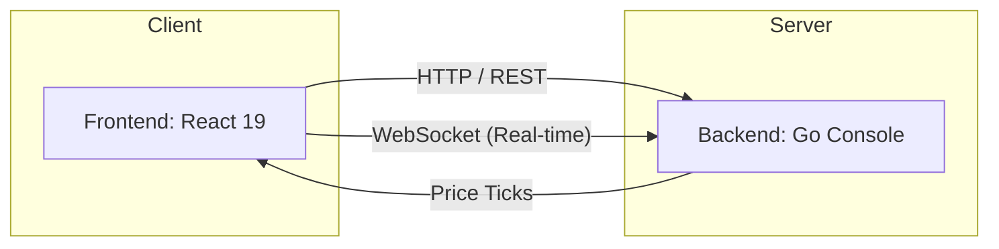

# 💹 Real-Time Stock Tracker - Enterprise Edition

A high-performance, resilient financial dashboard engineered to handle live market data streams with professional-grade precision. This project showcases a robust React 19 architecture, custom-built virtualization, and self-healing real-time connectivity.

---

## 🏛️ System Architecture

### 📁 Project Structure
The repository is split into two primary domains, ensuring a clean separation of concerns and independent scalability.
- **/frontend**: React 19 SPA powered by Vite, utilizing a feature-based module system for clean architecture.
- **/backend**: A containerized Go-based simulation server providing low-latency REST and WebSocket interfaces.

### 🖼️ High-Level Interaction


---

## 🚀 Key Engineering Achievements

### 1. High-Performance Grid Virtualization
**Status**: ✅ Implemented (Custom Engine)
Instead of opting for heavy external libraries, we implemented a custom **`useVirtualGrid`** hook. 
- **Efficiency**: Reduces DOM nodes by ~90% on large lists.
- **Responsiveness**: Dynamic column calculation and window-level scroll synchronization.
- **Tech Lead Note**: This approach ensures 60fps scrolling even with complex stock cards and high-frequency price updates.

### 2. Resilient WebSocket Pipeline
**Status**: ✅ Implemented & Refined
- **Self-Healing**: Implements Exponential Backoff (1s -> 30s) to survive network volatility.
- **Leak Prevention**: Advanced mounting guards prevent "closed during initialization" errors and memory leaks during navigation.
- **Subscription Lifecycle**: Automatic stream recovery upon reconnection ensure zero data loss for the user.

### 3. Professional Design System
**Status**: ✅ Refactored
- **Modular Styles**: Transitioned from inline styles to an encapsulated CSS architecture, improving maintainability and GPU-acceleration.
- **Zero CLS**: Integrated `Skeleton` layout systems ensure Cumulative Layout Shift (CLS) stays near zero during data hydration.
- **Brand Identity**: Premium Inter typography and a curated color palette for an enterprise-grade financial feel.

---

## 🔧 Core Technical Stack

- **Frontend**: React 19, Vite 7, TypeScript 5, Context API.
- **Visuals**: Recharts (Optimized for real-time minute-boundary stitching).
- **Testing**: Vitest with `ResizeObserver` mocks for virtualized environments.
- **Deployment**: Dockerized backend for 100% environment consistency.

---

## 📋 Running the Project

### 🐳 Production Deployment (Docker Compose)
The simplest way to deploy — a single command runs both frontend and backend:

```bash
docker compose up --build
```
> Application available at: `http://localhost` (port 80)

The frontend nginx container serves the SPA and reverse-proxies API/WebSocket requests to the Go backend internally.

### 💻 Local Development
1. **Backend**:
   ```bash
   docker compose up backend
   ```
2. **Frontend**:
   ```bash
   cd frontend && npm install && npm run dev
   ```
> Application available at: `http://localhost:5173`

### ⚙️ Environment Variables

| Variable | Default (Dev) | Description |
|---|---|---|
| `VITE_API_URL` | `http://localhost:3000` | Backend REST API base URL |
| `VITE_WS_URL` | `ws://localhost:3000/realtime-prices-ws` | WebSocket endpoint |
| `CORS_ORIGIN` | `*` | Allowed origin for backend CORS |

> **Note**: In production (Docker Compose), the frontend `.env.production` leaves these empty so URLs are auto-derived from the nginx reverse proxy — no manual configuration needed.

### ☁️ Cloud Deployment
This project is ready for one-click deployment on platforms that support Docker:
- **Railway** — Connect GitHub repo, deploy as Docker services
- **Render** — Frontend as Static Site, Backend as Web Service
- **DigitalOcean App Platform** — Docker-native deployment

---

## 📈 Team Lead Recommendations for Scale
As this project moves toward a production-scale enterprise application, I would prioritize the following:

1. **State Persistence**: Migrating global state to **Zustand** for better selector optimization and local-storage persistence.
2. **Server-State Management**: Implementing **TanStack Query** to handle API caching, background revalidation, and request deduplication.
3. **Web Worker Offloading**: Moving the real-time data normalization logic into background threads to keep the UI interaction thread entirely unblocked.

---
**Author**: Ahmed Muhammed Elsaid  
**Email**: [ahmed.muhammed.elsaid@gmail.com](mailto:ahmed.muhammed.elsaid@gmail.com)  
**Profile**: [Lead Frontend Engineer](https://github.com/AhmedMuhammedElsaid)
